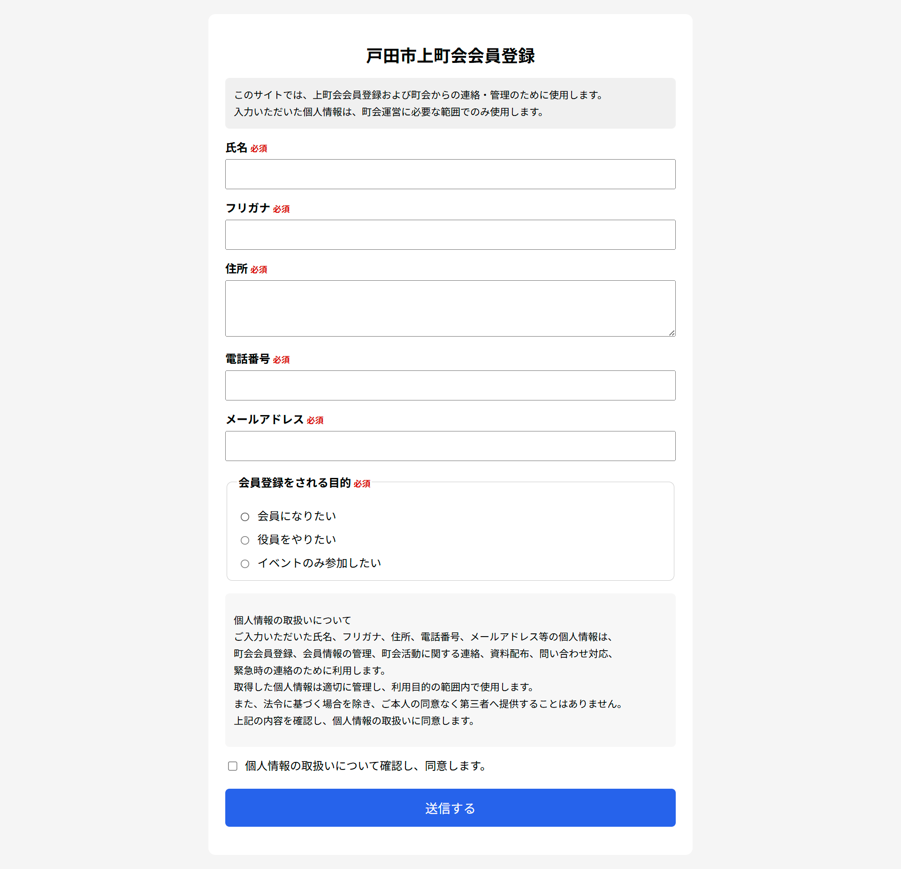

# 町会会員登録フォーム

GitHub Pages + TypeScript + Google Apps Script を使用して作成した、町会会員登録用のWebフォームです。

QRコードから登録フォームを開き、氏名・住所・電話番号などの会員登録情報を送信できます。  
送信された内容は、Google Apps Scriptを経由して、Gmailへ通知し、Googleスプレッドシートにも一覧として記録します。

---

## 概要

このアプリは、町会会員登録をオンラインで受け付けるための簡易フォームです。

利用者はスマートフォンでQRコードを読み取り、GitHub Pagesで公開された登録フォームにアクセスします。
フォームに必要事項を入力して送信すると、以下の処理が行われます。

```text
1. Google Apps Scriptへ登録内容を送信
2. 町会担当者のGmailへ登録内容を通知
3. Googleスプレッドシートへ登録内容を保存
```

---

## システム構成

```text
QRコード
 ↓
GitHub Pages
 ↓
TypeScriptで作成した登録フォーム
 ↓
Google Apps Script Webアプリ
 ↓
Gmail通知
 ↓
Googleスプレッドシートへ保存
```

---

## 画面イメージ

### 会員登録画面


### QRコード


---

## 公開URL

```text
https://simanuki0923.github.io/chokai-member-form/
```

---

## ローカル開発URL

```text
http://localhost:5173/
```

---

## 使用技術

| 区分           | 使用技術                |
| -------------- | ----------------------- |
| フロントエンド | HTML / CSS / TypeScript |
| ビルドツール   | Vite                    |
| 公開環境       | GitHub Pages            |
| 自動デプロイ   | GitHub Actions          |
| 送信処理       | Google Apps Script      |
| メール通知     | Gmail / MailApp         |
| データ保存     | Googleスプレッドシート  |

---

# 環境構築

```bash
git clone https://github.com/simanuki0923/chokai-member-form.git
cd chokai-member-form
npm install
npm run dev
npm run build
```

---

## 3. GitHub Pagesの設定

GitHubリポジトリ画面で以下を設定します。

```text
Settings
 ↓
Pages
 ↓
Build and deployment
 ↓
Source：GitHub Actions
```

この設定により、GitHub Actionsでビルドした内容がGitHub Pagesへ公開されます。

---

## 4. デプロイ結果の確認

GitHubリポジトリ画面で以下を確認します。

```text
Actions
 ↓
Deploy to GitHub Pages
 ↓
Status：Success
```

緑色のチェックが付いていれば、GitHub Pagesへの反映は完了です。

---

# Google Apps Script側の設定手順

## 1. Googleスプレッドシートを作成する

Googleスプレッドシートを新規作成します。

ファイル名の例：

```text
町会会員登録データ
```

シート名は以下にします。

```text
会員登録
```

---

## 2. スプレッドシートの見出し

1行目に以下の見出しを作成します。

```text
登録日時
氏名
フリガナ
住所
電話番号
メールアドレス
入会する目的
個人情報同意
```

フォームから送信された内容は、このシートに1行ずつ追加されます。

---

## 3. Apps Scriptを開く

Googleスプレッドシートの上部メニューから開きます。

```text
拡張機能
 ↓
Apps Script
```

---

## 4. Apps Scriptで行う処理

Apps Scriptでは、主に以下の処理を行います。

```text
1. フォームから送信されたJSONデータを受け取る
2. Googleスプレッドシートの「会員登録」シートを取得する
3. 登録内容をスプレッドシートへ1行追加する
4. 登録内容をGmailで通知する
5. エラーが発生した場合はエラー通知を送信する
```

---

## 5. Webアプリとしてデプロイする

Apps Script画面で以下を行います。

```text
デプロイ
 ↓
新しいデプロイ
 ↓
種類を選択
 ↓
ウェブアプリ
```

設定は以下です。

| 項目                   | 設定         |
| ---------------------- | ------------ |
| 種類                   | ウェブアプリ |
| 次のユーザーとして実行 | 自分         |
| アクセスできるユーザー | 全員         |

デプロイ後、以下のようなWebアプリURLが発行されます。

```text
https://script.google.com/macros/s/xxxxxxxxxxxxxxxx/exec
```

---

## 6. TypeScript側にApps Script URLを設定する

`src/main.ts` に、Apps ScriptのWebアプリURLを設定します。

URLは必ず `/exec` で終わるものを使用します。

```text
OK：
https://script.google.com/macros/s/xxxxxxxxxxxxxxxx/exec

```

---

## 7. Apps Script修正時の注意点

Apps Scriptのコードを修正した場合、保存だけではWebアプリに反映されない場合があります。

修正後は、必ず以下を行います。

```text
デプロイ
 ↓
デプロイを管理
 ↓
編集
 ↓
バージョン：新バージョン
 ↓
デプロイ
```

これを行わないと、GitHub Pagesから呼び出されるApps Scriptが古いままになることがあります。

---

## 1. 修正対象ファイル

| ファイル                       | 内容                     |
| ------------------------------ | ------------------------ |
| `index.html`                   | 画面構成・フォーム項目   |
| `src/style.css`                | デザイン・レイアウト     |
| `src/main.ts`                  | 送信処理・入力チェック   |
| `src/types.ts`                 | TypeScriptの型定義       |
| `vite.config.ts`               | GitHub Pages用のbase設定 |
| `.github/workflows/deploy.yml` | GitHub Actions設定       |

---
